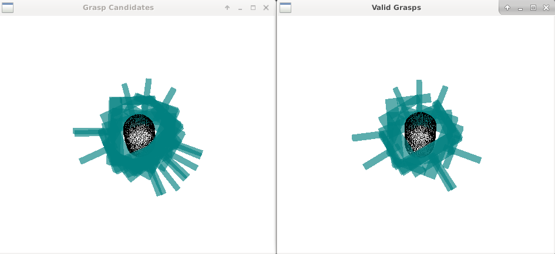
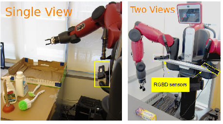
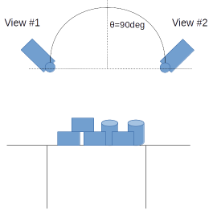

# Grasp Pose Detection (GPD)

* **Author:** Andreas ten Pas (atp@ccs.neu.edu)
* **Version:** 1.0.0
* **Author's website:** [http://www.ccs.neu.edu/home/atp/](http://www.ccs.neu.edu/home/atp/)
* **License:** BSD


## 1) Overview

This package detects 6-DOF grasp poses for a 2-finger grasp (e.g. a parallel jaw gripper) in 3D point clouds.

**Note: This version does not require Caffe.**


Grasp pose detection consists of three steps: sampling a large number of grasp candidates, classifying these candidates 
as viable grasps or not, and clustering viable grasps which are geometrically similar.

The reference for this package is: [High precision grasp pose detection in dense clutter](http://arxiv.org/abs/1603.01564).

### UR5 Video

<a href="http://www.youtube.com/watch?feature=player_embedded&v=kfe5bNt35ZI
" target="_blank"></a>


## 2) Requirements

1. [PCL 1.7 or later](http://pointclouds.org/)
2. [Eigen 3.0 or later](https://eigen.tuxfamily.org)
3. <a href="http://wiki.ros.org/indigo" style="color:blue">ROS Indigo</a> <span style="color:blue">and Ubuntu 
14.04</span> *or* <a href="http://wiki.ros.org/kinetic" style="color:orange">ROS Kinetic</a> 
<span style="color:orange">and Ubuntu 16.04</span>


## 3) Prerequisites

The following instructions work for **Ubuntu 14.04** or **Ubuntu 16.04**. Similar instructions should work for other 
Linux distributions that support ROS.

1. Install ROS. In Ubuntu 14.04, install ROS Indigo [(Instructions)](http://wiki.ros.org/indigo/Installation/Ubuntu). 
In Ubuntu 16.04, install ROS Kinetic [(Instructions)](http://wiki.ros.org/kinetic/Installation/Ubuntu).

2. Clone the [grasp_pose_generator](https://github.com/atenpas/gpg) repository into some folder:

   ```
   cd <location_of_your_workspace>
   git clone https://github.com/atenpas/gpg.git
   ```

3. Build and install the *grasp_pose_generator*: 

   ```
   cd gpg
   mkdir build && cd build
   cmake ..
   make
   sudo make install
   ```


## 4) Compiling GPD

1. Clone this repository.
   
   ```
   cd <location_of_your_workspace/src>
   git clone https://github.com/atenpas/gpd.git
   ```

2. Build your catkin workspace.

   ```
   cd <location_of_your_workspace>
   catkin_make
   ```


## 5) Generate Grasps for a Point Cloud File

Launch the grasp pose detection on an example point cloud:
   
   ```
   roslaunch gpd tutorial0.launch
   ```
Within the GUI that appears, press r to center the view, and q to quit the GUI and load the next visualization.
The output should look similar to the screenshot shown below.




## 6) Tutorials

1. [Detect Grasps With an RGBD camera](tutorials/tutorial_1_grasps_camera.md)
2. [Detect Grasps on a Specific Object](tutorials/tutorial_2_grasp_select.md)


## 7) Parameters

Brief explanations of parameters are given in *launch/classify_candidates_file_15_channels.launch* for using PCD files. 
For use on a robot, see *launch/ur5_15_channels.launch*. The two parameters that you typically want to play with to 
improve on then number of grasps found are *workspace* and *num_samples*. The first defines the volume of space in which 
to search for grasps as a cuboid of dimensions [minX, maxX, minY, maxY, minZ, maxZ], centered at the origin. The second 
is the number of samples that are drawn from the point cloud to detect grasps. You should set the workspace as small as 
possible and the number of samples as large as possible. 


## 8) Views



You can use this package with a single or with two depth sensors. The package comes with weight files for Caffe 
for both options. You can find these files in *gpd/caffe/15channels*. For a single sensor, use 
*single_view_15_channels.caffemodel* and for two depth sensors, use *two_views_15_channels_[angle]*. The *[angle]* is 
the angle between the two sensor views, as illustrated in the picture below. In the two-views setting, you want to 
register the two point clouds together before sending them to GPD.



To switch between one and two sensor views, change the parameter *trained_file* in the launch file 
*launch/caffe/ur5_15channels.launch*.


## 9) Input Channels for Neural Network

The package comes with weight files for two different input representations for the neural network that is used to 
decide if a grasp is viable or not: 3 or 15 channels. The default is 15 channels. However, you can use the 3 channels 
to achieve better runtime for a loss in grasp quality. For more details, please see the reference below.


## 10) Citation

If you like this package and use it in your own work, please cite our paper(s):

[1] Andreas ten Pas, Marcus Gualtieri, Kate Saenko, and Robert Platt. [**Grasp Pose Detection in Point 
Clouds**](http://arxiv.org/abs/1706.09911). The International Journal of Robotics Research, Vol 36, Issue 13-14, 
pp. 1455 - 1473. October 2017.

[2] Marcus Gualtieri, Andreas ten Pas, Kate Saenko, and Robert Platt. [**High precision grasp pose detection in dense 
clutter**](http://arxiv.org/abs/1603.01564). IROS 2016. 598-605.


## 11) Troubleshooting

* GCC 4.8: The package [might not compile](https://github.com/atenpas/gpd/issues/14#issuecomment-324789077) with 
GCC 4.8. This is due to [a bug](https://gcc.gnu.org/bugzilla/show_bug.cgi?id=58251) in GCC. **Solution:** Upgrade to 
GCC 4.9.